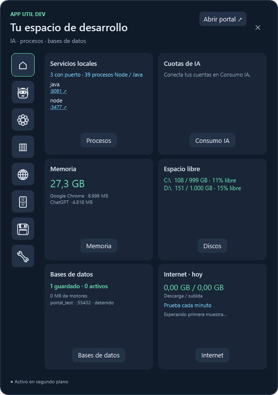
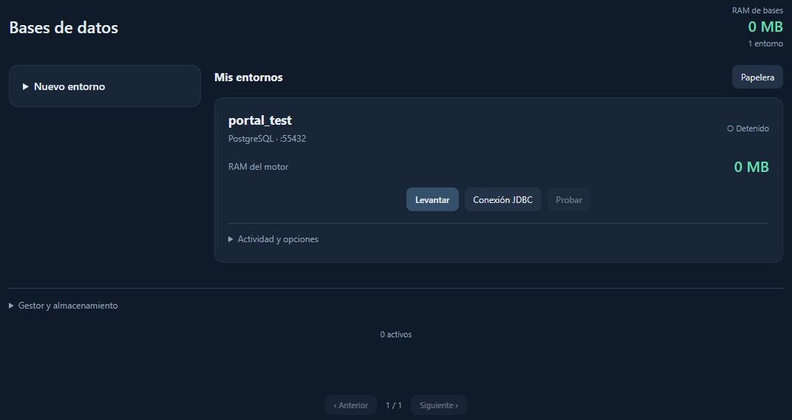

# dev-utils

Portal de utilidades para desarrolladores en Windows: monitorización de procesos y memoria, consumo de IA, pruebas de Internet, espacio de discos y gestión de bases de datos locales en una única ventana y un único icono en la bandeja. Interfaz azul oscuro con tarjetas y acentos verdes.

El clic en la bandeja muestra la vista rápida en la parte inferior derecha, sin barra de título. La cabecera de indicadores permanece visible en todos los apartados y sirve para navegar a Home, IA, procesos, memoria, Internet, bases de datos, discos y ajustes, sin menú lateral. Al hacer clic fuera, se oculta. **Abrir portal ↗** amplía esa misma interfaz; **Vista rápida ↘** vuelve al popup. Las vistas caben sin scroll. Las listas de procesos, aplicaciones, discos, cuotas de IA, adaptadores, bases de datos, conexiones y papelera muestran cuatro elementos por página.

## Capturas

Vista rápida con el resumen de procesos, memoria, discos, Internet e IA.



Gestor de bases de datos: entornos locales, arranque y conexión JDBC. La captura utiliza un entorno de prueba.



## Abrir

Descarga [AppUtilDev.exe](https://github.com/hbarragan/dev-utils/raw/refs/heads/main/AppUtilDev.exe), guárdalo en una carpeta estable donde puedas escribir y ejecútalo. Es una distribución portable para Windows x64: incluye .NET y no requiere instalar el SDK. El primer arranque extrae los componentes internos a la caché de .NET. El icono aparece en la bandeja; `Abrir.bat` muestra la ventana directamente. Microsoft Edge WebView2 Runtime debe estar instalado para las vistas de SQL y Claude.

```powershell
./build_exe.bat
./AppUtilDev.exe --show
```

`build_exe.bat` genera el ejecutable único `AppUtilDev.exe` en la raíz. Compilar desde código requiere el SDK .NET 8 o compatible. `build.ps1` sigue disponible para generar la distribución con archivos separados en `dist`.

## Portal común

- **Home:** resumen inicial con Node/Java y sus puertos, candidatos a revisar por inactividad, aplicaciones con mayor consumo de RAM, cuotas de Codex/Claude, estado de los entornos SQL y conectividad/VPN. Cada tarjeta lleva a su apartado. Reutiliza las muestras del monitor; el estado SQL se consulta cada cinco segundos mientras el Home está visible, sin cargar el navegador SQL. La memoria mostrada corresponde a las apps que superan 100 MB, no a toda la RAM del equipo.
- **Consumo IA:** límites de ChatGPT/Codex y conexión de Claude, utilizando tus propias sesiones.
- **Node / Java:** procesos, RAM, puertos y optimización con confirmación y protección de procesos.
- **Memoria:** aplicaciones agrupadas, con cierre normal o finalización tras confirmar. Los ejecutables de los motores portables del portal están protegidos; detenlos desde Bases de datos.
- **RED:** adaptadores, tráfico, diagnóstico, destino VPN y registro diario.
- **Internet:** descarga de 1 MiB y subida de 256 KiB cada minuto contra los endpoints de [Cloudflare](https://github.com/cloudflare/speedtest), también con el popup oculto. Son pruebas ligeras de transferencia HTTP: las velocidades incluyen el tiempo de petición y no equivalen a una medición de la capacidad máxima de la línea. Los fallos se muestran como no disponibles, sin convertirlos en 0 Mb/s. Las peticiones no se solapan y tienen tiempos de espera acotados. Puedes repetir la prueba con **Probar ahora**.
- **Tráfico de Home:** GB descargados / subidos del día en adaptadores físicos. Se conservan en `%LOCALAPPDATA%/AppUtilDev/network-totals.json` y se reinician al cambiar de día. El primer muestreo establece la referencia; no reconstruye el tráfico anterior a la primera ejecución. Incluye tráfico local y pruebas, y omite adaptadores VPN para evitar contar el mismo tráfico dos veces. La velocidad se muestra aparte en Mb/s.
- **Discos:** GB libres / capacidad y porcentaje libre de discos fijos, actualizados cada 30 segundos. La Home y la cabecera muestran el espacio libre global: suma de GB libres y capacidad de todos los discos, con porcentaje ponderado por capacidad. El apartado Discos muestra cuatro unidades por página.
- **Bases de datos:** PostgreSQL, MySQL y Babelfish, creación de entornos, arranque y parada, RAM, telemetría, conexiones, JDBC/Spring Boot, logs y papelera. Los motores se descargan al utilizarlos.

El flujo principal es **Nuevo entorno → Añadir entorno → Levantar**. No hace falta descargar un motor por separado: se prepara automáticamente si falta y se reutiliza en los siguientes arranques. Babelfish utiliza el driver de SQL Server, aunque su motor es PostgreSQL/WiltonDB. Los procesos consumen RAM y los datos permanecen en disco; no son bases exclusivamente en memoria. **Opciones** abre la actividad, las rutas, los logs y el arranque automático en un diálogo. **Eliminar** permanece visible en cada tarjeta, también en las páginas siguientes, y requiere confirmar el nombre de la base. **Gestor** abre la información de almacenamiento y la instalación del servicio.
- **Ajustes:** inicio con Windows, umbral de inactividad, ruta de Codex y desconexión de Claude. La navegación permanece en la cabecera superior.

Cerrar la ventana la oculta y mantiene activos el portal y los motores. **Salir** desde la bandeja o los ajustes apaga ordenadamente los motores portables antes de cerrar. Si hay una operación en curso, espera a que termine y vuelve a pulsar Salir.

Babelfish ofrece compatibilidad parcial con SQL Server mediante WiltonDB; no ejecuta Microsoft SQL Server y no admite MDF ni BAK.

## Scripts de arranque

En **Bases de datos → Opciones → Scripts de arranque** puedes añadir SQL, importar varios `.sql` o una carpeta completa. Se conserva la ruta de versiones, por ejemplo `2.0.0.0/01-schema.sql`, y se ordena numéricamente por versión y nombre. El lanzador de la app sustituye a `init-db.sh`: espera al motor, prepara la base y el usuario con la configuración del entorno y ejecuta los scripts. La inicialización integrada aparece siempre, es de solo lectura y no borra bases ni usuarios. La contraseña se representa como variable en la vista.

Los scripts se aplican **una vez** por defecto. El historial registra checksum SHA-256, fecha y número de ejecuciones; un script ya aplicado no se vuelve a ejecutar ni se puede cambiar con el mismo nombre. Añade una versión nueva para un cambio. **Ejecutar en cada arranque** permite repetir SQL, incluso modificado, cada vez que se levanta el entorno o se reanuda automáticamente al abrir la app. Activa **Levantar al iniciar** en Opciones para ese último caso. Quitar un script conserva su historial; no deshace sus cambios en la base.

Los scripts adicionales usan la conexión de administración sobre la base configurada. PostgreSQL y MySQL reciben el SQL del archivo; SQL Server/Babelfish separan los bloques `GO` sin interpretar los que aparecen dentro de literales o comentarios. Se usa la misma conexión para todos los bloques de un archivo. No se ejecuta Bash, directivas de sqlcmd (`:r`, `:setvar`, `!!`), `GO` con contador ni `DELIMITER`. La compatibilidad T-SQL depende del motor elegido.

Puedes usar `{{DB_NAME}}`, `{{DB_USER}}` y `{{DB_PASSWORD}}` como **tokens completos, sin comillas**. La app escapa identificadores y contraseña según el motor. Ejemplo T-SQL:

```sql
USE {{DB_NAME}};
GO
CREATE TABLE dbo.dev_example (id int PRIMARY KEY);
GO
```

Si un archivo falla, se detiene la secuencia y aparece el error en su tarjeta. El motor puede quedar activo y puede haber cambios parciales: los archivos no se envuelven en una transacción global. El siguiente arranque omite los anteriores completados y reintenta el pendiente. Si añades un script que elimina y recrea la base en cada arranque, marca también los scripts de schema y datos para cada arranque; el historial se guarda fuera de la base y no se reinicia al ejecutar `DROP DATABASE`.

SQL e historial se guardan cifrados en `private/state.dat`. No se suben a Git. Importar toma una copia: los cambios posteriores en los archivos de origen no se sincronizan. Límites: 100 scripts, 1 MB por archivo y 4 MB de SQL por entorno. El listado muestra cuatro elementos por página.

## Datos

Con el ejecutable único, SQL guarda `private`, `data`, `trash`, `engines`, `downloads` y `artifacts` junto al EXE. Mantén la aplicación en una carpeta estable para conservar los entornos.

En la distribución con archivos separados, SQL guarda `private`, `data`, `trash`, `engines`, `downloads` y `artifacts` junto a la carpeta `dist`. Las credenciales se cifran con DPAPI. Mantén esta carpeta estable para conservar los entornos.

Si ejecutas la compilación de desarrollo desde `bin`, SQL utiliza `%LOCALAPPDATA%/AppUtilDev/SqlLight`. Puedes fijar otra carpeta con `--root "C:\Ruta"`.

Los ajustes, el perfil de Claude y el perfil del navegador SQL se guardan en `%LOCALAPPDATA%/AppUtilDev`. Los límites de Codex utilizan la autenticación existente y no guardan su token.

Esta integración utiliza copias del código de los dos proyectos. No modifica las aplicaciones originales ni importa automáticamente sus bases de datos, preferencias o sesiones de Claude. Los entornos nuevos pertenecen a App Util Dev.

## Servicio opcional

El botón **Instalar como servicio de Windows** mantiene las bases en segundo plano mediante el servicio `AppUtilDevSql`. El portal se conecta al panel del servicio y continúa mostrando IA, procesos y red desde la sesión del usuario. Cerrar el portal deja el servicio activo.

La instalación requiere permisos de administrador y un ejecutable guardado en una carpeta estable (el EXE único o la distribución de `dist`). Se utiliza un servicio y registro de desinstalación propios, separados del servicio original `SqlLight`. Para desinstalarlo conservando los datos:

```powershell
./dist/AppUtilDev.exe --uninstall
```

La instalación real del servicio no forma parte de las pruebas automáticas del portal.

## Comprobaciones

```powershell
./test.ps1
./dist/AppUtilDev.exe --self-test
```

`test.ps1` verifica el host SQL en el mismo proceso, protección de la API, creación y persistencia cifrada de perfiles, rechazo de puertos inválidos, telemetría, reinicio y carga del panel real en WebView2. También verifica orden de migraciones, checksums, ejecución única/repetible, fallo y reintento, bloques GO, SQL cifrado, importación, edición y borrado desde el panel embebido. Usa una carpeta de pruebas nueva en `artifacts`; no descarga motores ni toca bases existentes.

`--self-test` comprueba las funciones heredadas de monitorización, procesos, protección, memoria, red, GPU, parsing de cuotas y vistas WPF. Las comprobaciones de integración necesitan los contadores y la sesión local de Codex.

`./AppUtilDev.exe --startup-engine-test` comprueba bootstrap, DDL, bloques GO y repetición tras reinicio en un entorno Babelfish nuevo dentro de `artifacts`; requiere el motor WiltonDB ya preparado.

Los resultados y capturas quedan en `artifacts` y se excluyen del control de versiones.

## Código

`src/AppUtilDev` contiene el portal WPF y la monitorización. `src/SqlLight` es el módulo del gestor de datos, enlazado como biblioteca. Su servidor se ejecuta dentro del portal en modo portable, sin un segundo icono de bandeja ni una segunda aplicación SQL. El panel escucha únicamente en `127.0.0.1`, con token por ejecución y controles de origen.


